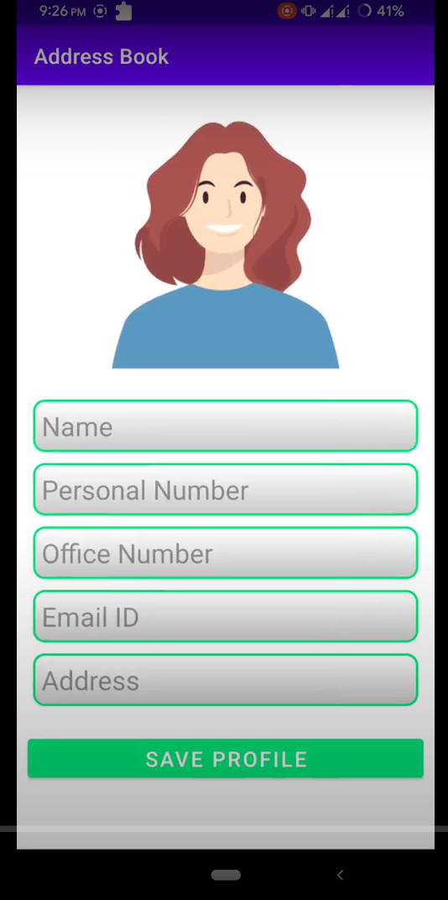

## Address-Book

A single page android java application that uses SQLite to store data and image of user. CRUD(Create, Read, Update and Delete) implementation of sqlite

## Features

- Can take image from Gallery or Camera
- Can detele, update and edit
- Shows invalid fiels if any

## Icon

<!--
## Demo

 -->

<!-- ## Task Given
 -->

## Screenshots

Screenshot#1               |  Screenshot#2
:-------------------------:|:-------------------------:
  |  

## 🔗 Links

